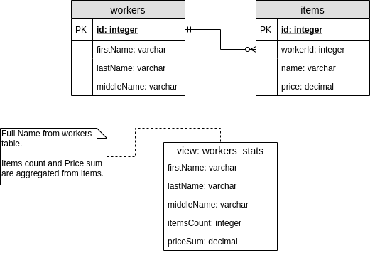

# Worker item app

Web application in which you could perform accounting of workers' personal tangibles.

Requirements could be found [here](assets/requirements.pdf).

## Tools ⚙️

- Web app - [Vue](https://vuejs.org)
- Service - [NestJS](https://nestjs.com/)
- ORM - [TypeORM](https://typeorm.io/)
- Database - [Postgres](https://www.postgresql.org/)

## Plan 📔

- [x] Making plan
- [x] Preparing the architecture
- [x] Design entities
- [ ] Decompose web app
- [ ] Plan and document the API
- [ ] Prepare pipeline
- [ ] Build and test:
  - [ ] Database and queries
  - [ ] Backend service
  - [ ] Web app
- [ ] Final test

## Development process 👷

### Making plan

First of all of course, you start from creating a plan, that one was easy enough. I started from skimming the requirements from what the application structure was understandable enough to make predictions. I chose Postgres (because it was the first in the list of dbs) and started scratching the whole system.

## The architecture

Simple Client-Server architecture build under REST abstraction. Client make calls to the REST service which generates query to the Relational DB.

## Designing entities

- Workers are described by their full name
- Workers could have 0 or more items
- Items are described by name and price

