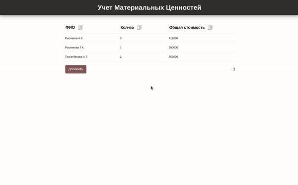
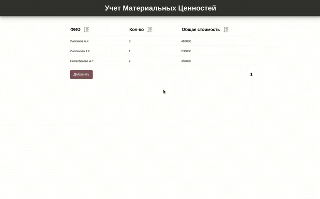
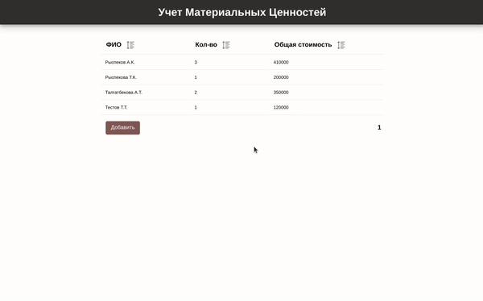

# Worker item app

Web application in which you could perform accounting of workers' personal tangibles.

Useful links:

- [Requirements](assets/requirements.pdf).
- [API documentation](api.md).
- [Configuration list](config-list.md)
- [How to install](install.md)

## Tools ⚙️

- Web app - [Vue](https://vuejs.org)
- Service - [NestJS](https://nestjs.com/)
- ORM - [TypeORM](https://typeorm.io/)
- Database - [Postgres](https://www.postgresql.org/)

## Plan 📔

- [x] Making plan
- [x] Preparing the architecture
- [x] Design entities
- [x] Decompose the web app
- [x] Plan and document the API
- [x] Build and test:
  - [x] Database and queries
  - [x] Backend service
  - [x] Web app
- [x] Final test

## Development process 👷

### Making plan

First of all of course, you start from creating a plan, that one was easy enough. I started from skimming the requirements from what the application structure was understandable enough to make predictions. I chose Postgres (because it was the first in the list of dbs) and started scratching the whole system.

### The architecture

Simple Client-Server architecture build under REST abstraction. Client make calls to the REST service which generates query to the Relational DB.

### Designing entities

- Workers are described by their full name
- Workers could have 0 or more items
- Items are described by name and price

### Decompose the web app

Main page consists of the table which displays `workers_stats` view. The app will fetch the amount of workers in the system, that number will be used to determine the number of pages.

Table itself will be used later, so it makes sense to create generic table view which consists of generic table rows. Table rows could be used for emitting events for mouse clicks and performing custom logic.

Editing or creating new worker, form looks the same, so single component will be used for both, however for different actions we could create two different routes. Those routes will have different metadata to determine logic inside.

Worker form has items table.

Overall, simple CRUD operations and a little bit of routing here, vuex not required.

### Plan and document the API

As REST's main principle to abstract things out, I'll do classical HTTP to CRUD mapping:

- `POST` for **C**reate
- `GET` for **R**ead
- `PUT` for **U**pdate
- `Delete` for **D**elete

### Database and queries

Tables, Views and relations are created automatically by TypeORM, so there's no need to do it manually. If you want, you can insert default data for testing purposes, query is [here](db/default-data.sql).

> Remember to execute app first, before running query above

### Backend service

Started writing backend with generating nest app, adding dependencies and integrating configs. After basic configurations, I integrated my ORM and build dependencies around it. Next processes are routine, so each api implementation could be described as an algorithm:

- Describe and plan api
- Build controller method and it's dependencies
- If needed, build validators and set the pipes
- Think of service methods and start implementing them
- Refactor the controller, so that it matches the specification
- Test it

In the real project, I honestly would go by TDD approach and build tests first, but for small project it's okay (No it's not :D).

Also to mention, there's a lot of boilerplate code that could be abstracted. For instance, writing pipes to perform joi validation (I could've written generic class that abstracts away the repeated code). But that's just about 4-5 lines savings, so in the small project like this it'll be considered as over-engineering.

And now that api is implemented, let's start building the UI.

### Web app

Using Vue CLI, I generated my app and performed basic configurations. Layout was already decomposed, so all that is left is just implementation. I started with App component, because it was the parent of all routing and by writing it's header component I will be done with sass configuration also.

So, I'm creating a number of generic components:

- `BaseButton` - generic looking button
- `AlertBox` - Box for generating user feedback on action
- `ConfirmBox` - Custom, promise-based Prompt Dialog
- `BaseTable` - A multi-task generic table

After implementing these, creating ui was much simpler.

For api calls I installed axios and abstracted such calls away. Ideally, there would be a service layer (or vuex), but I was running out of time.

### Final test

I started preparations by writing instructions of how to launch the app.

## In action

Sorting:

Editing:

Adding:

Deleting:

